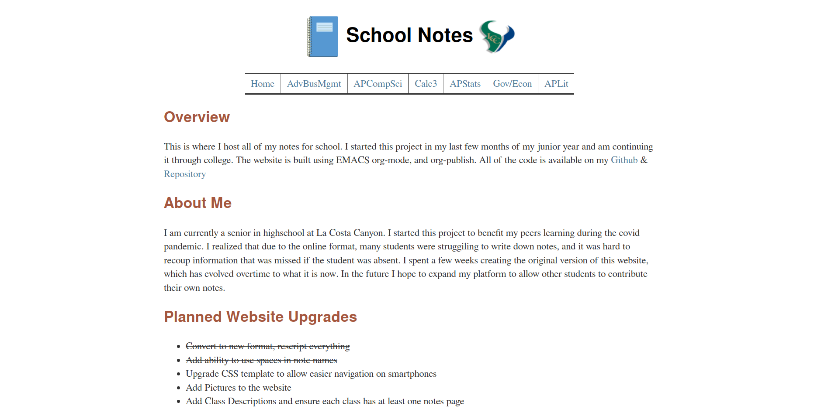

# School Notes
### An automatic note taking and publishing system 

Available at https://ajburns651.github.io/School-Notes/public/index.html

### Backend
 - Emacs & Org-Mode to create organized note files
 - Org-html-publish-to-html function exports .org to .html format
 - link.sh creates links to from each class's home page to respective note files
 - Folder is watched and will run Upload.sh if any changes are detected
